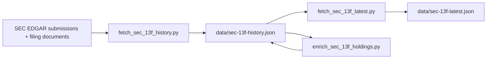

# Refresh Existing 12 Managers 13F Data — Design

## Goal

Refresh the project’s SEC-derived 13F datasets for the **existing 12 tracked managers only**, so the site reflects the newest filings actually available from SEC EDGAR as of the update run.

## Scope

Included:

- Keep the current 12-manager catalog unchanged.
- Refresh `data/sec-13f-history.json` from SEC filings using the existing fetch pipeline.
- Regenerate `data/sec-13f-latest.json` from refreshed history data.
- Run the existing enrichment pass so ticker/share helpers remain populated where possible.
- Verify that the refreshed datasets remain internally consistent and usable by the current frontend.

Excluded:

- Adding new managers.
- Changing the frontend UX or institution catalog.
- Manually inventing missing quarterly data for managers that have not yet filed.
- Refactoring unrelated scripts while doing the data refresh.

## Recommended Approach

Use the repository’s existing SEC pipeline end to end:

1. Run the history refresh script against SEC EDGAR.
2. Derive the latest snapshot file from the refreshed history file.
3. Run the enrichment script.
4. Validate the output files and summarize which managers advanced to a newer quarter.

This is preferred over manual edits because it preserves the repository’s current data model, keeps the update reproducible, and continues to align with the scheduled GitHub Actions workflow already present in the project.

## Data Flow

## Validation

The update is successful when all of the following are true:

- The dataset still contains exactly the same 12 tracked manager IDs.
- Each manager’s newest stored filing matches the latest SEC filing actually available at refresh time.
- `sec-13f-latest.json` matches the newest filing per manager in `sec-13f-history.json`.
- The JSON files parse successfully and preserve the schema expected by the current frontend.
- Any manager without a newer SEC filing remains on its prior quarter instead of receiving fabricated data.

## Existing Workspace Constraints

The local repository already contains uncommitted changes related to compact JSON output and other local work. The refresh should preserve those changes and avoid unrelated edits. Any implementation work should be limited to data regeneration and only the minimum supporting adjustments required if the existing pipeline fails against current SEC responses.

## Risks and Handling

- **SEC rate limits or transient failures:** retry through the existing HTTP helper and verify partial results before accepting output.
- **Manager-specific filing quirks:** rely on the existing normalization/enrichment flow first; add only targeted fixes if a current SEC filing exposes a real parser gap.
- **Mixed filing availability:** report exactly which managers advanced and which did not, rather than forcing all 12 onto the same quarter.

## Verification Outputs

After implementation, report:

- Before/after latest quarter for all 12 managers.
- Any managers still on the previous quarter because no newer SEC filing exists.
- The commands run for refresh and validation.
- Any supporting script changes made, if needed.
